# 程序设计方案说明书

[toc]

## 1.概述

### 1.1  程序功能

从RabbitMQ中获取卫星传入站点的数据,并将数据按帧解析成具体信息存入数据库

### 1.2 开发环境

Windows10 x64

Visual Studio 2019  Community Edition

Mysql Server5.7 x32

C++连接RabbitMQ采用[SimpleAmqpClient][https://github.com/alanxz/SimpleAmqpClient]

C++连接Mysql采用Mysql自带的库

## 2.程序设计

### 2.1 程序逻辑

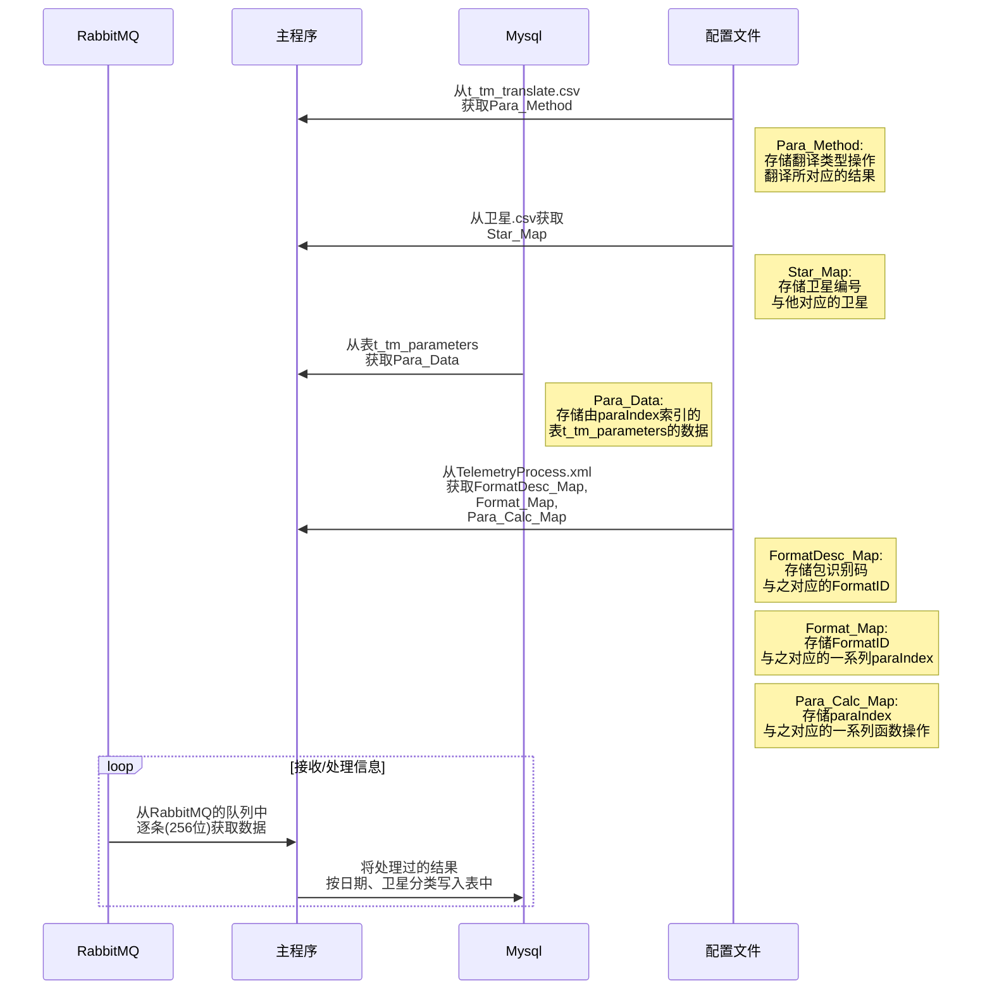

### 2.2 配置文件

#### 	2.2.1 t_tm_translate.csv:

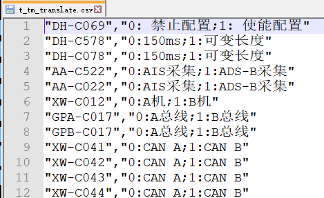

前者为对应操作的para_code,后者为翻译库

#### 	2.2.2 卫星.csv:

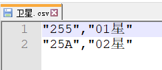

前者为卫星编号,后者为卫星名

#### 2.2.3 TelemetryProcess.xml

##### 2.2.3.1 FormatDesc

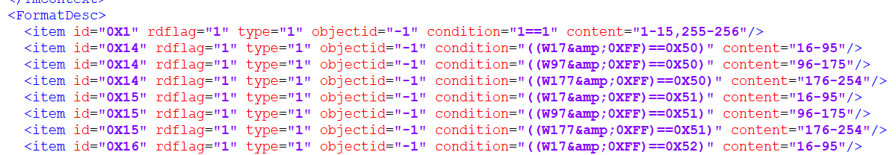

condition的后4位为包标识码，id为Format_ID

e.g. 第三行condition为0X50,即包标识码为0X50,Format_ID为0X14

##### 2.2.3.2 Format

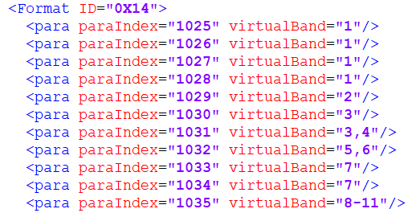

ID为上一步获取的Format_ID,paraIndex为操作编号,virtualBand为操作计算所需要的位数

e.g. 编号为“0X14”需要执行“1025”-“1035”的操作,virtualBand为“1”表示取数据包的第一位,“3,4”表示取数据包的第二位,“8-11”表示取数据包的第8到第11位

##### 2.2.3.3 Calculate

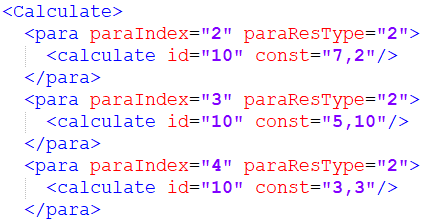

paraIndex为操作编号,~~paraResType为结果输出类型(另换为数据库中的my_type)~~,id为函数编号,表示要执行何种函数,const为函数参数,其中上一步获取的virtualBand的值为函数输入

e.g. 

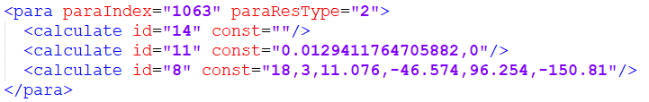

操作"1063"依次要执行函数"14",函数"11",函数"8",其中函数"14"没有函数参数,函数"11"参数为0.0129411764705882和0,函数"8"参数为18,3,11.076,-46.574,96.254,-150.81

### 2.3 数据库设计

#### 2.3.1 t_tm_parameters

**字段:**

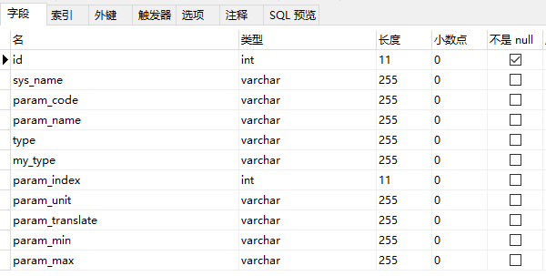

**数据:**

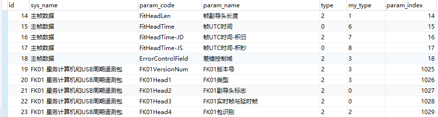

我们所用到的字段为param_code,param_name,my_type,param_index

其中param_code帮助我们获取有翻译操作的翻译库

param_index为上面所提到的paraIndex

#### 2.3.2 analysis_result_s

**数据库命名:**

analysis_results_s_ 日期 _卫星名称

​	e.g. analysis_result_s_20200721_01星

**字段:**

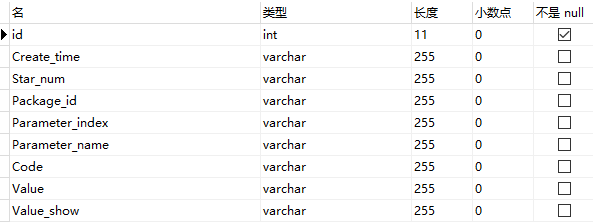

Create_time:入库时间 

​	e.g. 2020.07.21 15:33:18

Star_num:卫星编号 

​	e.g. 02星

Package_id:包名称

​	e.g. FK01

Parameter_index:即paraIndex,操作编号

​	e.g. 1063

Code:操作所需函数输入的16进制表示

​	e.g. 24AA25F8

Value:操作函数的输出(double类型)

​	e.g. -41.665142

Value_Show:根据函数输出显示最终结果

### 2.4 代码设计

#### 2.4.1代码文件

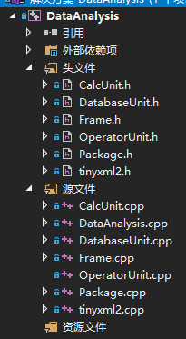

DataAnalysis.cpp:主程序

CalcUnit.h/cpp:函数库计算

Database.h/cpp:连接Mysql,输入输出

Frame.h/cpp:存储帧数据

Package.h/cpp:存储包数据

OperatorUnit.h/cpp:存储操作单元

tinyxml2.h/cpp:读取xml文件

#### 2.4.2 属性配置

C/C++--常规--附加包含目录:

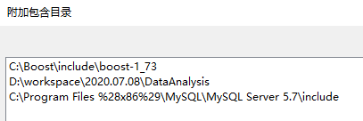

链接器--常规--附加库目录:

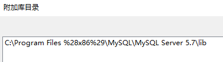

链接器--输入--附加依赖项:

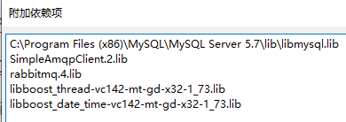

.dll文件(添加至根目录):

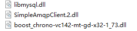

